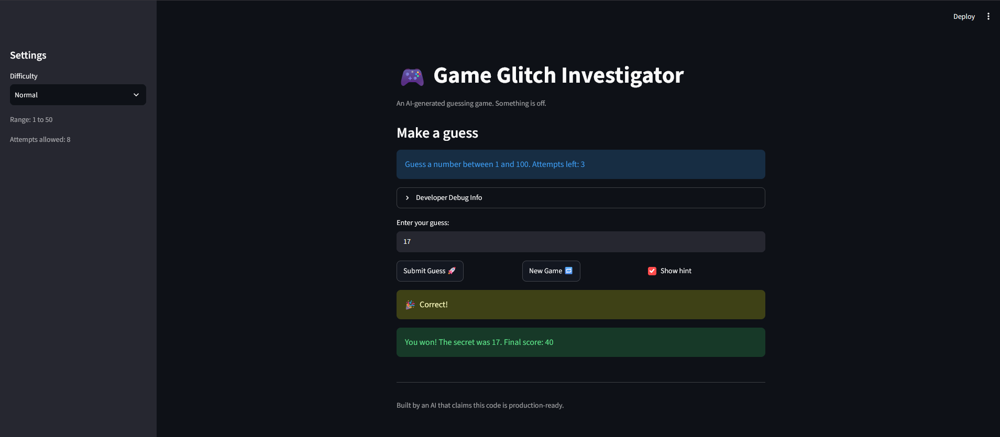

# 🎮 Game Glitch Investigator: The Impossible Guesser

## 🚨 The Situation

You asked an AI to build a simple "Number Guessing Game" using Streamlit.
It wrote the code, ran away, and now the game is unplayable. 

- You can't win.
- The hints lie to you.
- The secret number seems to have commitment issues.

## 🛠️ Setup

1. Install dependencies: `pip install -r requirements.txt`
2. Run the broken app: `python -m streamlit run app.py`

## 🕵️‍♂️ Your Mission

1. **Play the game.** Open the "Developer Debug Info" tab in the app to see the secret number. Try to win.
2. **Find the State Bug.** Why does the secret number change every time you click "Submit"? Ask ChatGPT: *"How do I keep a variable from resetting in Streamlit when I click a button?"*
3. **Fix the Logic.** The hints ("Higher/Lower") are wrong. Fix them.
4. **Refactor & Test.** - Move the logic into `logic_utils.py`.
   - Run `pytest` in your terminal.
   - Keep fixing until all tests pass!

## 📝 Document Your Experience

- [ ] Describe the game's purpose.

   The game's purpose is to let the user play a number guessing game, allowing the user to play in one of three difficulties: Easy, Normal, or Hard. The attempts allowed and number range for guesses changes with each mode accordingly. From a meta view, the game's purpose for CodePath students is to use AI to debug, refactor, and better understand a codebase.

- [ ] Detail which bugs you found.

   Section 1 of reflection.md better explains the bugs I found but in summary, the ones I personally found by manually going through the app and reading through the code: Pressing "Enter" in the guess textbox does not submit the guess (debatable if even a bug), wrong hints and go higher and go lower messages should be swapped, if guess is left as whitespace submitting the guess still decrements the attempt counter, New Game button does not work after a game ends either by winning or losing, checking "Show hint" only makes the hint appear after submitting a guess (also debatable if a bug, might make sense if you're given a point penalty for having it checked), and "Attempts left" shows one attempt less than the total attempts allowed for each mode. 

- [ ] Explain what fixes you applied.

   From the bugs I found manually, AI applied fixes to the wrong hints and swapping the higher and lower messages (row 2 of bug log), The whitespace-only guess being counted for the attempts (parse_guess validation, row 3 of bug log), New Game button logic fixed with updated session values and allowing its use at any point, including after a game ends (row 4 of bug log), and attempts now start at 0 instead of 1, and the "Attempts left" box fills in after the guess is counted (off-by-one fixed, last row of bug log)

## 📸 Demo Walkthrough

Describe your fixed game in numbered steps so a reader can follow along without watching a video:

1. User guesses 51. 
2. "Guess must be between 1 and 50." is shown since that's the new range for Normal mode.
3. User guesses 25
4. Game says "Go HIGHER!"
5. User guesses 40.5
6. Game tells user to "Please enter a whole number."
7. Game ends after the correct guess.


**Screenshot** *(optional)*: 

## 🧪 Test Results

```
# Paste your pytest output here, e.g.:
# pytest tests/
# ========================= X passed in 0.XXs =========================
```

## 🚀 Stretch Features

- [ ] [If you choose to complete Challenge 4, describe the Enhanced UI changes here — a screenshot is optional]
